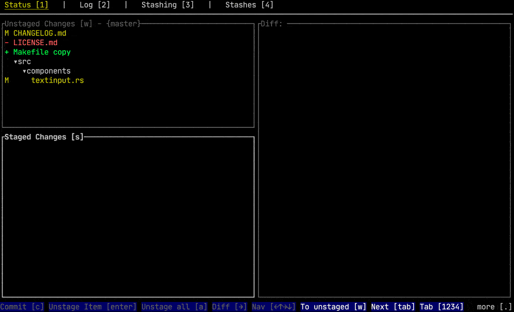

<h1 align="center">


![CI][s0] [![crates][s1]][l1] ![MIT][s2] [![UNSAFE][s3]][l3] [![ITCH][s4]][l4]
</h1>

[s0]: https://github.com/extrawurst/gitui/workflows/CI/badge.svg
[s1]: https://img.shields.io/crates/v/gitui.svg
[l1]: https://crates.io/crates/gitui
[s2]: https://img.shields.io/badge/license-MIT-blue.svg
[s3]: https://img.shields.io/badge/unsafe-forbidden-success.svg
[l3]: https://github.com/rust-secure-code/safety-dance/
[s4]: https://img.shields.io/badge/itch.io-ok-green
[l4]: https://extrawurst.itch.io/gitui

blazing fast terminal-ui for git written in rust



# features

* fast and intuitive key only control
* context based help (**no** need to remember any hot-key)
* inspect/commit changes (incl. hooks: *commit-msg*/*post-commit*)
* (un)stage files/hunks, revert/reset files/hunk
* stashing (save, apply, drop)
* browse commit log
* scalable ui layout
* async [input polling](assets/perf_compare.jpg) and 
* async git API for fluid control

# benchmarks

For a [RustBerlin meetup presentation](https://youtu.be/rpilJV-eIVw?t=5334) I compared *lazygit*,*tig* and *gitui* parsing the entire linux git repository (~900k commits):

||lazygit|tig|**gitui**|
|--|--|--|--|
|time| 57s | 4m 20s |**24s**
| mem |2.6 gb|1.3 gb| **170 mb** 
| binary | 16 mb | **600 kb** | 1.4 mb
| freezes  | yes | soso | **no** 
| crashes  | sometimes | no | **no** 

presentation slides: https://github.com/extrawurst/gitui-presentation

# known limitations

* no support for [bare repositories](https://git-scm.com/book/en/v2/Git-on-the-Server-Getting-Git-on-a-Server) (see [#100](https://github.com/extrawurst/gitui/issues/100))
* [core.hooksPath](https://git-scm.com/docs/githooks) config not supported
* revert/reset hunk in working dir (see [#11](https://github.com/extrawurst/gitui/issues/11))

# motivation

I do most of my git usage in a terminal but I frequently found myself using git UIs for some use cases like: index/commit, diff, stash and log.

Over the last 2 years my go-to GUI tool for this was [fork](https://git-fork.com) because it was not bloated, snappy and free. Unfortunately the *free* part will [change soon](https://github.com/ForkIssues/TrackerWin/issues/571) and so I decided to build a fast & simple terminal tool myself to copy the fork features i am using the most.

# installation

For the time being this product is considered alpha and **not** production ready.

## Arch Linux

There is an [AUR package for `gitui`](https://aur.archlinux.org/packages/gitui/):

```sh
git clone https://aur.archlinux.org/gitui.git
cd gitui
makepkg -si
```

## Fedora

```sh
sudo dnf install gitui
```

## homebrew (macos)

```
brew install extrawurst/tap/gitui
```

## release binaries

see [releases](https://github.com/extrawurst/gitui/releases)

## install from source

### requirements

install **latest** `rust`/`cargo`: https://www.rust-lang.org/tools/install

### cargo install

the simplest way to start playing around with `gitui` is to have `cargo` build/install it:

```
cargo install gitui
```

# diagnostics

to enable logging:
```
gitui -l
```

this will log to:
* `$HOME/Library/Caches/gitui/gitui.log` (mac)
* `$XDG_CACHE_HOME/gitui/gitui.log` (linux using `XDG`) 
* `$HOME/.cache/gitui/gitui.log` (linux)

# color theme


In general `gitui` should automatically work on `dark` and `light` terminal themes.
However you can customize everything to your liking: [see THEMES.md](THEMES.md)

# inspiration

* https://github.com/jesseduffield/lazygit
* https://github.com/jonas/tig
* https://github.com/git-up/GitUp (would be nice to comeup with a way to have the map view available in a terminal tool)
